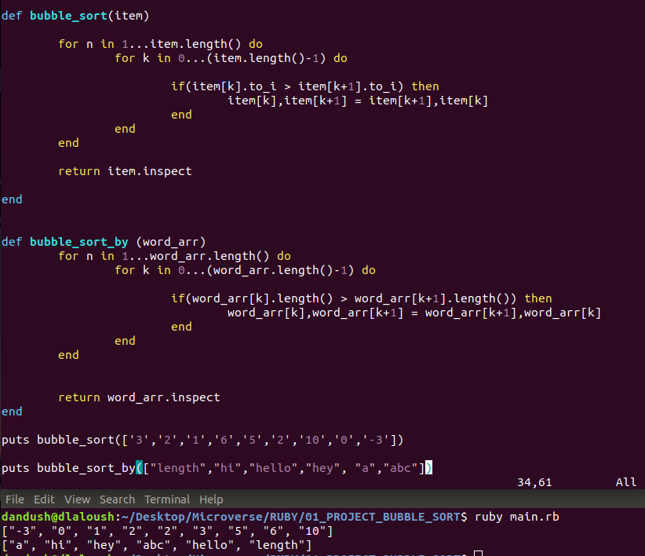

# Microverse - RUBY - Bubble Shorting Project

> In this project, We got the chance to build our FIRST RUBY program. We will be fallowing the instruction displayed in [The Odin Project](https://www.theodinproject.com/courses/ruby-programming/lessons/advanced-building-blocks)

*Here we'll add an screenshot of our code/results*

## Built With

- RUBY
- Visual Studio Code
- Vim

## Getting Started

**This Project is for Testing Our Abilities in Ruby Programming**

## Authors

**Salvador Olvera**
- Linkedin: [Salvador Olvera](https://www.linkedin.com/in/salvador-olvera-n)
- Twitter: [@Salvador Olvera_ON](https://twitter.com/Salvador_ON)
- Github: [@Salvador-ON](https://github.com/Salvador-ON)

**Daniel Laloush**
- Linkedin: [Daniel Laloush](https://www.linkedin.com/in/daniel-laloush-0a7331a9)
- Github: [@Dandush03](https://github.com/Dandush03)
- Twitter: [@d_laloush](https://twitter.com/d_laloush)

## 🤝 Contributing

Contributions, issues and feature requests are welcome!

Feel free to check the [issues page](./issues/).

## Show your support

Give as ⭐️ if you like this project!

## Acknowledgments

- Hat tip to anyone whose code was used
- Thanks to Microverse!

## 📝 License

This project is [MIT](lic.url) licensed.
